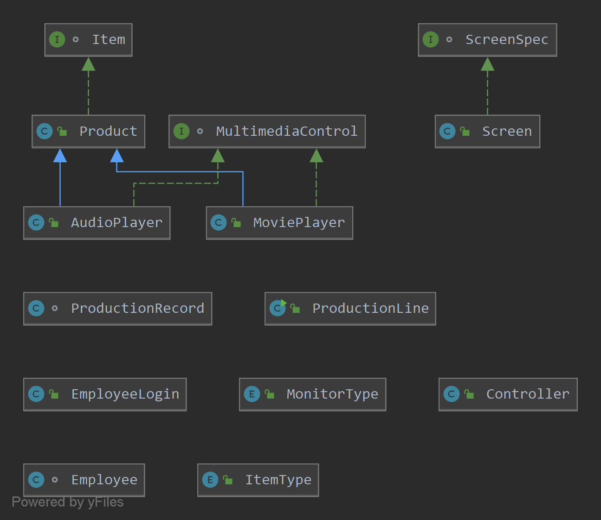
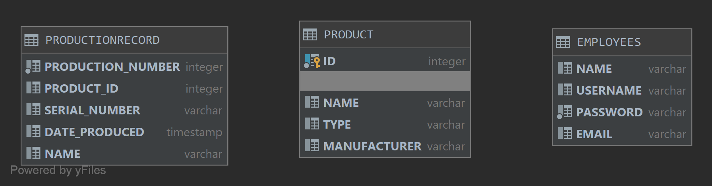

# Production Line

- Project description: Production Line is an inventory tracking system that warehouses and other large companies would be able to implement into their business. It allows for the following functions:
  1. The system shall allow for the creation of new products that will be available for distribution.
  2. The system shall show production records for every product in inventory and will display the product's name, manufacturer, serial number, production number, and the date that the production was performed.
  3. The system shall show all products in the database and will allow for either production of the product or the removal of the product from inventory at user discretion.
  4. The system shall allow for a username and password verification system that either approves or declines users based on password and username combinations.
  5. The system shall allow for new employees to be added to the system and access to the inventory tracking system.
  6. The system shall create an _audit trail_ for tracking what production employees create.
  
- Production Line was created solely by Andrew Cavallaro as part of an Object-Oriented Programming class project. It was created initially during my Junior year of college at Florida Gulf Coast University in Fort Myers, Florida. The anticipated plan for the future of this project is to continue and add more functionality and perhaps features companies would like to implement that would fit their business needs.

## Demonstration

## Documentation

- Please use the following link to view the [JavaDoc](https://acavallaro75.github.io/ProductionLine/index.html) for this project.

## Diagrams
##### Class Diagram:

##### Database Visualization:

## Getting Started

## Built With

- The integrated development environment (IDE) used for this project was IntelliJ IDEA Ultimate Edition. The Java Development Kit (JDK) is Java 8.1.221.

- The database that is implemented in this project is an H2 database. The database contains three tables: employees, product, and production record. The employee database tracks employee's names, usernames, emails, and passwords and is used to verify login information to allow access to the program. The product database tracks the product's ID number, name, type, and manufacturer. The production record database tracks production of the products in the product database and has the following columns: production number, product ID, serial number, and date produced.

- The graphical user interface (GUI) was built using SceneBuilder.

## Contributing

- If anyone would like to contribute, give feedback, or would like more information, feel free to email me at [andrew.cavallarojr@gmail.com].

## Author
- Andrew Cavallaro

## License

## Acknowledgments

## History

## Key Programming Concepts Utilized
