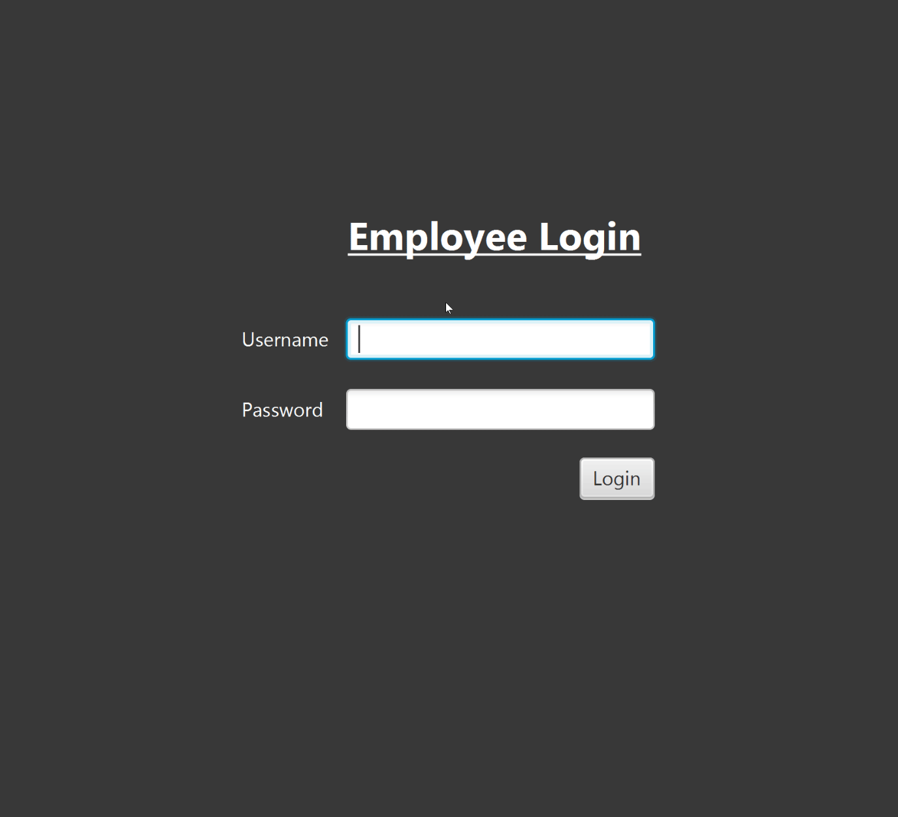

# Production Line

Project description: Production Line is an inventory tracking system that warehouses and other large companies would be able to implement into their business. It allows for the following functions:
  1. The system shall allow for the creation of new products that will be available for distribution.
  2. The system shall show production records for every product in inventory and will display the product's name, manufacturer, serial number, production number, and the date that the production was performed.
  3. The system shall show all products in the database and will allow for either production of the product or the removal of the product from inventory at user discretion.
  4. The system shall allow for a username and password verification system that either approves or declines users based on password and username combinations.
  5. The system shall allow for new employees to be added to the system and access to the inventory tracking system.
  6. The system shall create an _audit trail_ for tracking what production employees create.
  
Production Line was created solely by Andrew Cavallaro as part of an Object-Oriented Programming class project. It was created initially during my Junior year of college at Florida Gulf Coast University in Fort Myers, Florida. The anticipated plan for the future of this project is to continue and add more functionality and perhaps features companies would like to implement that would fit their business needs.

## Demonstration

## Documentation

Please use the following link to view the [JavaDoc](https://acavallaro75.github.io/ProductionLine/index.html) for this project.

## Diagrams
##### Class Diagram:

##### Database Visualization:

## Getting Started

- On the [home page](https://github.com/Acavallaro75/ProductionLine) of the Sandy Shores resort, select the clone or download drop-down menu and copy the URL displayed in that menu. Alternatively, the link is here for your convenience: https://github.com/Acavallaro75/ProductionLine.git.

- Once the link has been copied, open your Java IDE, preferably IntilliJ IDEA Ultimate Edition by JetBrains as that was what was used to produce the project, and select "Get from Version Control".

- Paste the copied URL into the field URL and choose where you would like to save this project and select clone.

- You will be prompted with a message asking if you would like to open the project. Select yes to view the project.

- A runnable jar file has been made, so you should only need to go to the ProductionLine class in the production package and press run to access the program.

- On the left side of the ProductionLine class select the green triangle and select "Run 'ProductionLine.main()'" and the program should run.

- The database also has been implemented with a jar file, so that should aslo work with no problems.

- For initial running purposes, use admin and password for the username and password fields, respectively.

## Built With

- The integrated development environment (IDE) used for this project was IntelliJ IDEA Ultimate Edition. The Java Development Kit (JDK) is Java 8.1.221.

- The database that is implemented in this project is an H2 database. The database contains three tables: employees, product, and production record. The employee database tracks employee's names, usernames, emails, and passwords and is used to verify login information to allow access to the program. The product database tracks the product's ID number, name, type, and manufacturer. The production record database tracks production of the products in the product database and has the following columns: production number, product ID, serial number, and date produced.

- The graphical user interface (GUI) was built using SceneBuilder.

## Contributing

If anyone would like to contribute, give feedback, or would like more information, feel free to email me at andrew.cavallarojr@gmail.com.

## Author
Andrew Cavallaro

## License

MIT License

Copyright (c) 2019 Andrew Cavallaro

Permission is hereby granted, free of charge, to any person obtaining a copy
of this software and associated documentation files (the "Software"), to deal
in the Software without restriction, including without limitation the rights
to use, copy, modify, merge, publish, distribute, sublicense, and/or sell
copies of the Software, and to permit persons to whom the Software is
furnished to do so, subject to the following conditions:

The above copyright notice and this permission notice shall be included in all
copies or substantial portions of the Software.

THE SOFTWARE IS PROVIDED "AS IS", WITHOUT WARRANTY OF ANY KIND, EXPRESS OR
IMPLIED, INCLUDING BUT NOT LIMITED TO THE WARRANTIES OF MERCHANTABILITY,
FITNESS FOR A PARTICULAR PURPOSE AND NONINFRINGEMENT. IN NO EVENT SHALL THE
AUTHORS OR COPYRIGHT HOLDERS BE LIABLE FOR ANY CLAIM, DAMAGES OR OTHER
LIABILITY, WHETHER IN AN ACTION OF CONTRACT, TORT OR OTHERWISE, ARISING FROM,
OUT OF OR IN CONNECTION WITH THE SOFTWARE OR THE USE OR OTHER DEALINGS IN THE
SOFTWARE.

## Acknowledgments

- Scott Vanselow
- https://www.w3schools.com/java/

## History

Production Line is in it's beginning stages and will be updated periodically over time. Check here for project updates and see how the project has evolved over time. Currently, see project description for the initial history of Production Line.

## Key Programming Concepts Utilized

#### Enums

- A special "class" that represents a group of constants
  - There are two enums in Production Line:
    - Item Type: contains the types of items that can be stored into production and their associated codes
    - Monitor Type: contains the two types of monitors for visual products

#### Inheritance

- A mechanism in which a child object acquires all the properties and behaviors of a parent object
  - There are two instances of inheritance in Production Line:
    - The AudioPlayer class extends (inherits) the Product class
    - The MoviePlayer class extends (inherits) the Product class

#### Interfaces

- A Java construct that helps define the roles that an object must assume
  - There are three interfaces and four classes that implement them in Production Line:
    - The Product class implements the Item interface
    - The MoviePlayer class implements the MultimediaControl interface
    - The AudioPlayer class implements the MultimediaControl interface
    - The Screen class implements the ScreenSpec interface

#### JDBC and SQL

- Products, employees, and production records are all stored into the H2 database via JDBC and SQL statements.
- Connection, Statement, PreparedStatement, and ResultSet objects are all used in this process.
- The database is secured via a remote password stored in a read-only text file.

#### Exceptions and Assertions

- Exception: an event, which occurs during the execution of a program, that disrupts the normal flow of the program's instructions
- Error handling has been implemented to prevent wrongful entry of Products into the database.
- Try and catch clauses are used throughout for SQL error handling

#### Collections

- A framework that provides an architecture to store and manipulate the group of objects
  - The following Collections are used in Production Line:
    - Array lists
    - Lists
    - Observable lists

#### Regular Expressions (Regex)

- Regular expressions is used for searching, manipulating and editing a string.
- Password verification for Production Line is achieved through the power of Regex.
- Passwords must contain at a minimum one upper-case letter, one lower-case letter, and a special character.

#### Recursion

- A process in which a method calls itself continuously until it reaches a base class
- Recursion is used in Production Line for storing passwords to the H2 database.
- The original password is stored as a reverse copy of itself and when checked in the database is reverted back to it's original state to verify matching values.

#### Lambdas

- A function which can be created without belonging to any class, can be passed around as if it were an object and executed on demand
